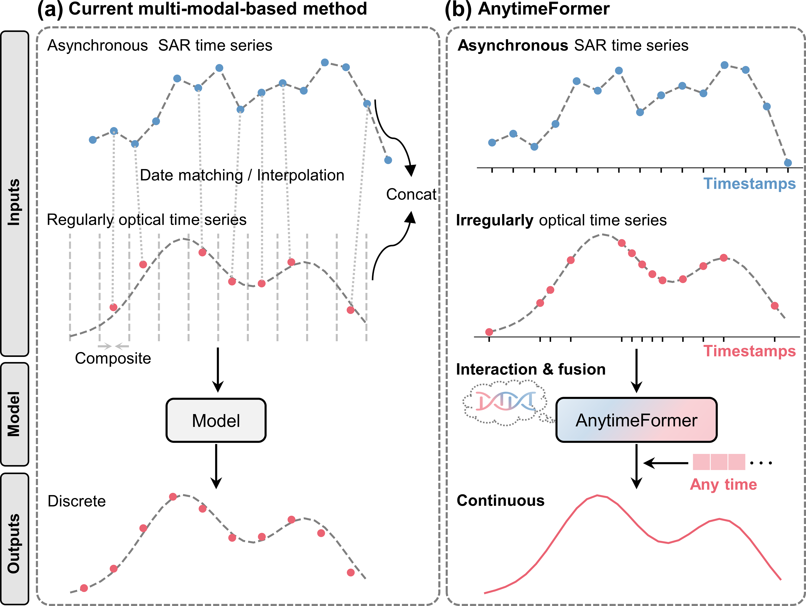

## AnytimeFormer: Fusing irregular and asynchronous SAR-optical time series to reconstruct reflectance at any given time

<p align="center">
  <!-- Stars -->
  

  <!-- Forks -->
  

  <!-- Visitors -->
  

  <!-- License -->
  
</p>

> **Authors:** Kai Tang, Xuehong Chen, Tianyu Liu, Anqi Li, Yao Tang, Peng Yang, Jin Chen*
  
---

## 📰 News

- **[2025-11]** **AnytimeFormer** has been accepted by *Remote Sensing of Environment (RSE)* !  


## 📜Outline

- [Hightlights](#-hightlights)
- [Installation](#-installation)
- [Dataset Preparation](#-dataset-preparation)
- [Training](#-training)
- [Testing](#-testing)
- [Future](#-future)
- [Citation](#-citation)

---

## 🚀Hightlights

1.	Proposes AnytimeFormer for gap-free surface reflectance time series reconstruction.
2.	AnytimeFormer adapts to irregular optical and asynchronous SAR time series.
3.	AnytimeFormer supports reflectance reconstruction at any given time.
4.	An average 38% decrease in RMSE compared to the five benchmark methods.
5.	Reduces training time by ten times compared to STORI, the second-best model.
---

## 🏗 Architecture

<div align="center">
  
</div>

## 📦Installation

### Step 1. Clone/download the repository

```bash
git clone https://github.com/tangkai-RS/AnytimeFormer.git
cd AnytimeFormer
```

### Step 2. Create environment and install dependencies

```bash
conda create -n anytime python=3.8
conda activate anytime
pip install torch==1.12.1+cu116 torchvision==0.13.1+cu116 torchaudio==0.12.1 --extra-index-url https://download.pytorch.org/whl/cu116
pip install -r requirements.txt
conda install -c conda-forge gdal=3.4.3
```
## 📚Dataset Preparation

### Dataset

- **Germany-site** can be found and downloaded here: [Huggingface](https://huggingface.co/datasets/tangkaii/AnytimeFormer/tree/main)
- **Other sites' shpfiles** can be found and downloaded here: [Google Drive](https://drive.google.com/file/d/1_687m4KndC2K3k18JfDZpX4t03KDuhGR/view?usp=sharing)

After downloading the Germany-site dataset and placing it in the folder `./datasets/`, please follow the directory structure below:  

```
dataset  
|-- dataset_for_model  
|   |-- Germany             
|   |   |-- tif               
|   |   |   |-- 40%            
|   |   |   |-- 60%           
|   |   |   |-- 80%          
|   |   |-- hdf
```
<p style="text-align: justify;">
  <b>Note:</b> Due to the large volume of timeseries data, only preprocessed data for the Germany site is provided here for quick testing. 
  Dataset for other sites can be downloaded and preprocessed using shapefile and Google Earth Engine (GEE). 
  For GEE and preprocessing scripts, please refer to folder 
  <a href="preprocess/README.md" target="_blank">Data Preparation Guide</a>.
</p>


## 🔥Training

### For Linux
#### Mode 1: <span style="color: #5F96C6;">Sequence to Sequence</span>
Perform AnytimeFormer training with normal mode (sequence to sequence):
```bash
bash scripts/train-Germany.sh
```
or
```bash
WORK_DIR="work_dir/Germany/base"
ORIGINAL_DATASET_PATH="dataset/dataset_for_model/Germany/hdf/random_missing.hdf"
REF_TIF_PATH="dataset/dataset_for_model/Germany/tif/40%/S2_L2A_20190208.tif"
CONFIG_FILE="configs/Germany/base/AnytimeFormer-Germany-40%-r8-128.yaml"

python main.py \
    --config_path $CONFIG_FILE \
    --work_dir $WORK_DIR \
    --original_dataset_path $ORIGINAL_DATASET_PATH \
    --ref_tif_path $REF_TIF_PATH \
    --mode "train_test" \
    --debug_mode False \
    --cal_performance_metric True
```
#### Mode 2: <span style="color: #EB6373;">✨Anytime</span>
Perform AnytimeFormer training with anytime mode (support any given time outputs):
```bash
bash scripts/train-Germany-anytime.sh
```
or
```bash
WORK_DIR="work_dir/Germany/anytime"
ORIGINAL_DATASET_PATH="dataset/dataset_for_model/Germany/hdf/anytime.hdf"
REF_TIF_PATH="dataset/dataset_for_model/Germany/tif/40%/S2_L2A_20190208.tif" 
CONFIG_FILE="configs/Germany/anytime/AnytimeFormer-Germany-40%-r8-128-wTV.yaml"

python main.py \
    --config_path $CONFIG_FILE \
    --work_dir $WORK_DIR \
    --original_dataset_path $ORIGINAL_DATASET_PATH \
    --ref_tif_path $REF_TIF_PATH \
    --mode "train_test_anytime" \
    --debug_mode False
```

### For Windows
On Windows systems, you can directly modify the arguments in `main.py` and run it without using shell scripts.  
For more details about parameter settings, please refer to:  

- Lines **414–507** in `main.py`, where detailed comments for each argument are provided
- [configs](configs/Germany/base/AnytimeFormer-Germany-40%25-r8-128.yaml) — configuration file  

Note that any arguments specified directly in `main.py` will override the corresponding parameters in the configuration files (`configs`).
If you have any questions about parameter setting, please submit issues.

#### Results
After training, you can find the results in the following locations:
```
work_dir
|-- Germany
|   |-- anytime
|   |-- base
|   |   |-- 2025-10-30_T20-22-31_AnytimeFormer-Germany-40%-r8-128
|   |   |   |-- inference
|   |   |   |-- models
|   |   |   |-- log.log
```

- **Model Weights**  
  Located in the `models/` folder: best_model.ckp
- **Output Images**  
In the `inference/` folder, you can find two types of images:
- **Imputed Images**  
   - Only the missing regions in the original time-series images are replaced with the model's predictions.
- **Reconstructed Images**  
   - The entire time-series images are generated by the model's predictions.
- **Performance Metric**  
  - If `--cal_performance_metric` is set to `True`, the accuracy metrics can also be found in `log.log`.

## ❄️Testing

### For Linux
#### Mode 1: <span style="color: #5F96C6;">Sequence to Sequence</span>
Perform AnytimeFormer training with normal mode (sequence to sequence):
```bash
bash scripts/inference-Germany.sh
```
or
```bash
WORK_DIR="work_dir/Germany/base"
ORIGINAL_DATASET_PATH="dataset/dataset_for_model/Germany/hdf/random_missing.hdf"
REF_TIF_PATH="dataset/dataset_for_model/Germany/tif/40%/S2_L2A_20190208.tif"
CONFIG_FILE="configs/Germany/base/AnytimeFormer-Germany-40%-r8-128.yaml"
SAVED_MODEL_PATH="work_dir/Germany/best_model_40%.ckpt"

python main.py \
    --config_path $CONFIG_FILE \
    --work_dir $WORK_DIR \
    --original_dataset_path $ORIGINAL_DATASET_PATH \
    --ref_tif_path $REF_TIF_PATH \
    --mode "test" \
    --saved_model_path $SAVED_MODEL_PATH
```
#### Mode 2: <span style="color: #EB6373;">✨Anytime</span>
Perform AnytimeFormer training with anytime mode (support any given time outputs):
```bash
bash scripts/inference-Germany-anytime.sh
```
or
```bash
WORK_DIR="work_dir/Germany/anytime"
ORIGINAL_DATASET_PATH="dataset/dataset_for_model/Germany/hdf/anytime.hdf"
REF_TIF_PATH="dataset/dataset_for_model/Germany/tif/40%/S2_L2A_20190208.tif" 
CONFIG_FILE="configs/Germany/anytime/AnytimeFormer-Germany-40%-r8-128-wTV.yaml"
SAVED_MODEL_PATH="work_dir/Germany/best_model_anytime.ckpt"

python main.py \
    --config_path $CONFIG_FILE \
    --work_dir $WORK_DIR \
    --original_dataset_path $ORIGINAL_DATASET_PATH \
    --ref_tif_path $REF_TIF_PATH \
    --mode "test_anytime" \
    --saved_model_path $SAVED_MODEL_PATH \
    --debug_mode False
```
- **Pay attention to ```anytime_ouput```** of the [config.yaml](configs/Germany/anytime/AnytimeFormer-Germany-40%25-r8-128-wTV.yaml)

### For Windows
On Windows systems, you can directly modify the arguments in `main.py` and run it without using shell scripts.  

For more details about parameter settings, relative to training, you only need to make the following modifications:  
- Set `--mode` to `"test"` (seq2seq model) or `"test_anytime"` (anytime mode) 
- Set `--saved_model_path` to the path of the best trained model
- **Pay attention to ```anytime_ouput```** of the [config.yaml](configs/Germany/anytime/AnytimeFormer-Germany-40%25-r8-128-wTV.yaml)

✨If you have any questions about parameter setting, please submit issues.


## 🔭 Future

We will gradually release pipelines for some benchmark methods (e.g., U-TILISE and RESTORE-DiT) to help more people follow and join the time-series reconstruction field.

## 📄 Citation

```bibtex
Comming soon
```

✨If you have any questions or collaboration suggestions, please contact us (tangkai@mail.bnu.edu.cn).